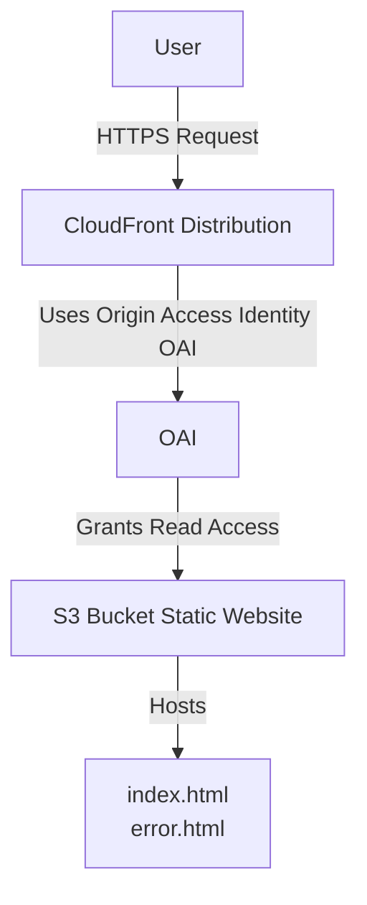

# -Cloudfront

##  Diagram



 ## terraform diagram
 ```
 terraform-cloudfront-app/
├── main.tf
├── provider.tf
├── s3.tf
├── cloudfront.tf
├── upload.tf
├── variables.tf
├── outputs.tf
└── modules/
    └── (optional reusable module directories)
```


